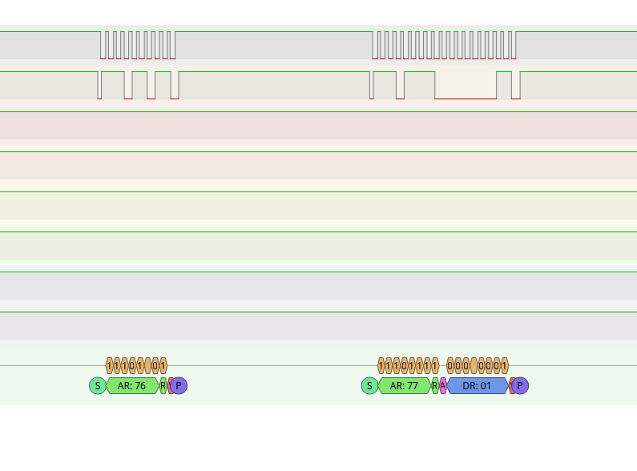

# Pico W - Scan the I2C bus

This is an example project that uses a [repository template](https://github.com/gherlein/pico-template) and the [pico-lib3 library](https://github.com/gherlein/pico-lib3/tree/main).

This code does not do much, but can be a starting point to see how to communicate with I2C devices.  Currently it will scan the bus and show what devices it finds by printing to the uart.

## Wiring

The default for pico-lib3 is to use I2C0.  See the [I2C docs](https://github.com/gherlein/pico-lib3/blob/main/docs/sys_i2c.md). 

For this example, that's SCL on GP7 and SDA on GP6 (pico pins 11 and 12, respectively).

## Example of No Devices

```
I2C Bus Scan
   0  1  2  3  4  5  6  7  8  9  A  B  C  D  E  F
00 .  .  .  .  .  .  .  .  .  .  .  .  .  .  .  .
10 .  .  .  .  .  .  .  .  .  .  .  .  .  .  .  .
20 .  .  .  .  .  .  .  .  .  .  .  .  .  .  .  .
30 .  .  .  .  .  .  .  .  .  .  .  .  .  .  .  .
40 .  .  .  .  .  .  .  .  .  .  .  .  .  .  .  .
50 .  .  .  .  .  .  .  .  .  .  .  .  .  .  .  .
60 .  .  .  .  .  .  .  .  .  .  .  .  .  .  .  .
70 .  .  .  .  .  .  .  .  .  .  .  .  .  .  .  .
Done.
```

## Example of Devices Found

```
I2C Bus Scan
   0  1  2  3  4  5  6  7  8  9  A  B  C  D  E  F
00 .  .  .  .  .  .  .  .  .  .  .  .  .  .  .  .
10 .  .  .  .  .  .  .  .  .  .  .  .  .  .  .  .
20 .  .  .  .  .  .  .  .  .  .  .  .  .  .  .  .
30 .  .  .  .  .  .  .  .  .  .  .  .  .  .  .  .
40 .  .  .  .  .  .  .  .  .  .  .  .  .  .  .  .
50 .  .  .  .  .  .  .  .  .  .  .  .  .  .  .  .
60 .  .  .  .  .  .  .  .  .  .  .  .  .  .  .  .
70 .  .  .  .  .  .  .  @  .  .  .  .  .  .  .  .
Done.
```

## Using a Logic Analyzer

If you are using a simple logic analyzer to see the I2C messages, a failed and good read from the bus looks like this:

 <br>

I use a [cheap one I bought on Amazon](https://www.amazon.com/gp/product/B077LSG5P2/ref=ppx_yo_dt_b_search_asin_title?ie=UTF8&psc=1) and the Open Source program [Pulseview](https://sigrok.org/wiki/PulseView).  I blogged about [getting that running on Linux](https://blog.herlein.com/post/pulseview-linux/).

